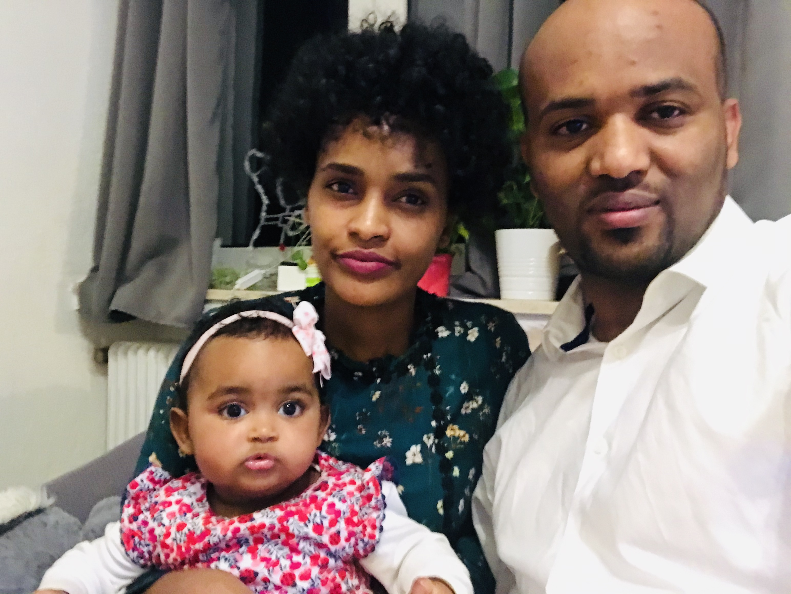

I am from a family who were from village, 300km from the capital of the country. During my childhood, I used to support my grandparents in farming and looking after cattles. It was very memorable, and it gave me a chance to primitive life moods, life-without-technology. 

During my holiday break, I like visiting different cities. E.g. I have visited cities like  Paris, Ljubljana, Prague, Berlin, Venice, Rome, vienna, Skovdie, Ulm, Bonn,  and so on. 

 

I have established a family, and currently we have one baby girl. Outside the research, I like to spend time with my families, and friends.

 

I am practicing playing Guitar in my free time. It makes me relax and enjoy after a day or even week long busy academic and research activities. 

[BACK TO HOME](../index.html)
