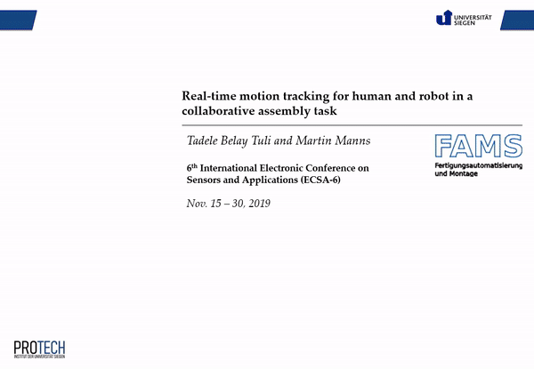
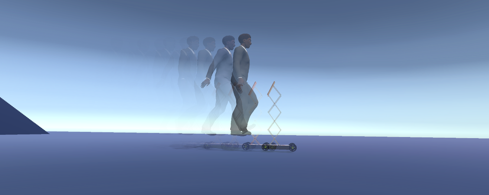
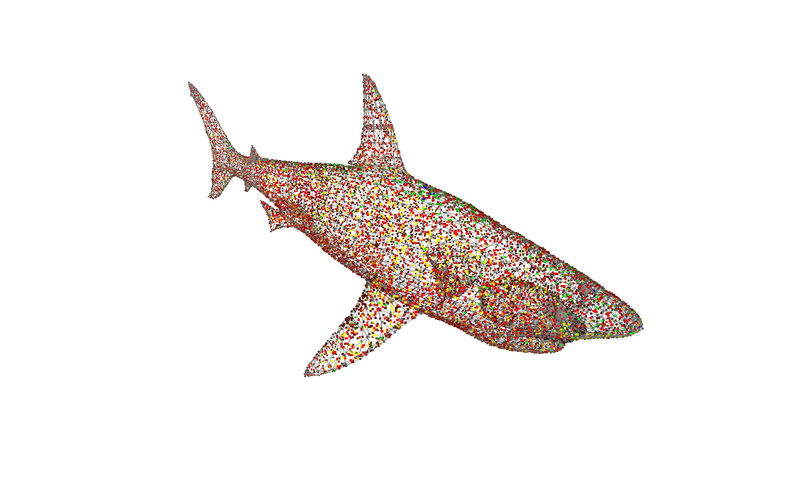
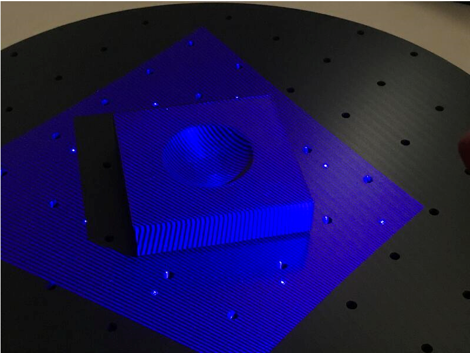

Reversing humans toward robots' space - Humans have been at distant from a robot space for decades. However, it is shown that robots alone are not efficient. Therefore, I am working on methods how humans and robots exist in harmony and collaborate. In , methods that employ human motion behavior, ontology of human-robot collaboration and AI based data modeling are presented.This investigation has been further elaborated regarding the human activity identification and intention prediction 

Details of projects I am involved is given as follows;

## Human motion capture using HTC Vive

Human-robot collaboration combines the extended capabilities of humans and robots to create a more inclusive and human-centered production system in the future.
However, human safety is the primary concern for manufacturing industries.
Therefore, real-time motion tracking is necessary to identify if the human worker body parts enter the restricted working space solely dedicated to the robot.
Tracking these motions using decentralized and different tracking systems requires a generic model controller and consistent motion exchanging formats.
In this work, our task is to investigate a concept for a unified real-time motion tracking for human-robot collaboration.
In this regard, a low cost and game-based motion tracking system, e.g., HTC Vive, is utilized to capture human motion by mapping into a digital human model in the Unity3D environment .

## ROS Based Robot Control - for deformable objects

Force compliant industrial robots are used to manipulate soft and deformable objects in real-time simulation.
However, such objects, e.g. additively manufactured elastomers, are difficult to manipulate due to unknown deformation behavior when pressure is applied.
In this regard, we applied a hierarchical force and position controller to analyze how the deformation of additively manufactured objects with different cross-sectional cavities take place.
Therefore, this approach can be applied to analyze the effect of force on the stiffness of objects with cavities .\\
[References](https://protech.mb.uni-siegen.de/fams/research/)  

## Design and Modeling of Telepresence Robots

Adjustable, mobile and interactable robots, nowadays are useful to assist human beings for some social interactions. One example could be telepresence in pandemic crisis such as COVID-19.
However, human-robot physical interactions are still challenging regarding maneuverability, controllability, stability, drive layout, and autonomy.
Hence, this project presents a systematic design and control approach based on the customer's needs and expectations of telepresence mobile robots for social interactions.
A system model and controller design are developed using the Lagrangian method and linear quadratic regulator (LQR), respectively, for different scenarios such as flat surface, inclined surface, and yaw (steering).
The robot system is capable of traveling uphill (30deg) and has a variable height (600-1200 mm).
The robot is advantageous in developing countries to fill the skill gaps as well as for sharing knowledge and expertise using a virtual and mobile physical presence .

 

Fig. - Demonstration of human and robot interaction while walking

 
## Bond graph approach for modeling Gantry robots

Objective: This project aims to present an initial mathematical modeling and dynamic simulation of gantry robot for the application of printing circuit on board. The classical modeling methods such as Newton-Euler, Kirchoff's law and Lagrangian fails to unify both electrical and mechanical system models. Here, bond graph approach with robust trajectory planning which uses a blend of quadratic equations on triangular velocity profile is modeled in order to virtually simulate it. In this paper, the algebric mathematical models are developed using maple software. For the sake of simulation, the model is tested on matlab by integrating robot models which are developed by using Solidwork [% cite tuli_mathematical_2018 %].

 
 
# 3D printing and NC

I am collaborating with different researchers on 3D printing and NC tools for optimizing motion paths. To list some, bio-inspired shapes, prototyping tools, and robot integration.
\

Please, check the related projects that are categorized as follows; 

 
## 3D printing for rapid prototyping

"We printed the die from PLA, a bio-based standard material for AM. Using a gom optical scanner, we investigated if deformation or attrition of the forming tool occurs in a small batch series.
 
\

The approach opens up great chances for on-demand "rapidprototyping" of sheet metal parts, in particular as it’s based on a cheap and recyclable material."
\
[References](https://doi.org/10.1007/s00170-021-07312-y)

 
## Path planning and Tool path generation for NC Machines

Tool-path, feed-rate, and depth-of-cut of a tool determine the machining time, tool wear, power consumption, and realization costs.
Before the commissioning and production, a preliminary phase of failure-mode identification and effect analysis allows for selecting the optimal machining parameters for cutting,
which, in turn, reduces machinery faults, production errors and, ultimately, decreases costs.
For this, scalable high-precision path generation algorithms requiring a low amount of computation might be advisable.
The present work provides such a simplified scalable computationally low-intensive technique for tool-path generation.
From a three dimensional (3D) digital model, the presented algorithm extracts multiple two dimensional (2D) layers.
Depending on the required resolution, each layer is converted to a spatial image, and an algebraic analytic closed-form solution provides a geometrical tool path in Cartesian coordinates.
The produced tool paths are stacked after processing all object layers. Finally, the generated tool path is translated into a machine code using a G-code generator algorithm.
The introduced technique was implemented and simulated using MATLAB pseudocode with a G-code interpreter and a simulator.
The results showed that the proposed technique produced an automated unsupervised reliable tool-path-generator algorithm and reduced tool wear and costs, by allowing the selection of the tool depth-of-cut as an input.
\
[References](https://doi.org/10.3390/jmmp3040084)

References
----------



[BACK TO HOME](../index.html)
